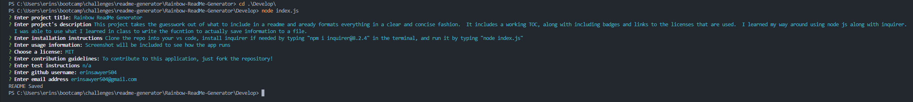

# Rainbow ReadMe Generator

## Description
This project takes the guesswork out of what to include in a readme and aready formats everything in a clear and concise fashion.  It includes a working TOC, along with including badges and links to the licenses that are used.  I learned my way around using node js along with inquirer.  I was able to use what I learned in class to write the fucntion to actually save information to a file. 

## Table of Contents
- [Installation](#installation)  
- [Usage](#usage)  
- [License](#license)  
- [Constributing](#contributing)  
- [Tests](#tests)  
- [Questions](#questions)

## Installation
Clone the repo into your vs code, install inquirer if needed by typing "npm i inquirer@8.2.4" in the terminal, and run it by typing "node index.js"

## Usage
Screenshot will be included to see how the app runs

## License
This repository is covered under the [MIT](https://opensource.org/licenses/MIT) license.

## Contributing
To contribute to this application, just fork the repository!

## Tests
n/a

## Questions
GitHub username: erinsawyer504
GitHub profile: (https://www.github.com/erinsawyer504)    
Email address: erinsawyer504@gmail.com  
If you have additional questions, please feel free to email me.